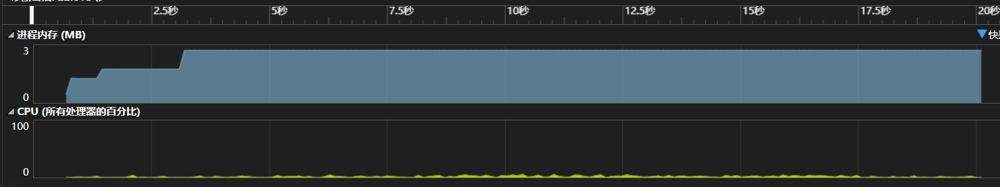
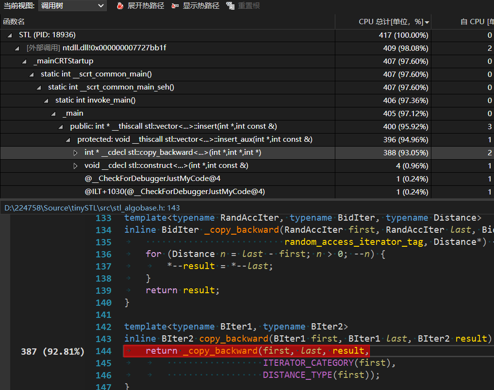
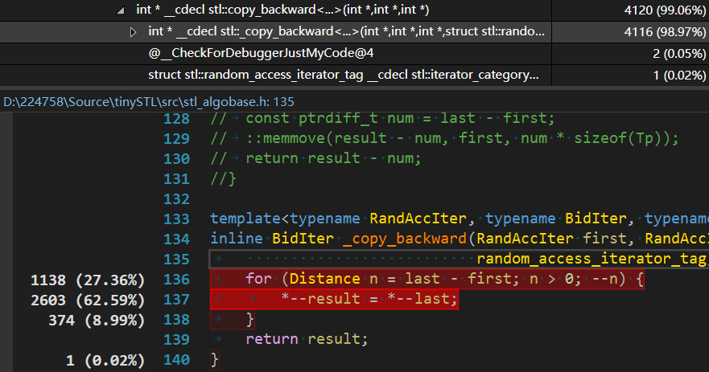

# tinySTL
# STL源码剖析

## Introduction
动手实现`tinySTL`（这里指`SGI-STL V3.3`，或者侯捷老师使用的`GNU-C2.9`）。这里只复现了`allocator`和`container`以及部分的`functor`和`adaptor`，对于算法`algorithm`部分没有过多涉及。通过阅读和`code`，能够发现其中设计思路的巧妙，这里很推荐《`STL`源码剖析》这本书。

`docs`是一些笔记和总结，仅以此仓库存档。
## 小插曲
实现过程中，会有各种`debug`，此时发现，没有测试过的代码的可靠性几乎为`0`，测试过的代码虽然也不一定可靠，但是潜在的`bug`修复过程，其实也是对内存运作理解的一个过程，这里举一些例子：

（1）模板实例化找不到合适的模板
```c++
void function(char a, char b){/* */} // 1
void function(int a, int b){/* */}   // 2
// ...
void call(){function(xx,xx);}
template<typename A, typename B>
void function(A a, B b){/* */}       // 3
```
这里简化了问题，调用`call`，有些时候可以，但是有些时候编译失败。这是因为当调用是偏特化的函数，也就是`1,2`这种情况，是没有问题的；但是一旦需要模板，由于定义在`call`之后，编译器很有可能找不到模板函数，因此出现找不到合适的模板，此时需要将`call`放置在模板函数之后。

（2）性能
`tinySTL`和工业界的`STL`（这里对比了`Windows 11 VS v143`）。
对于简单对象而言（以`int`为例），在百万级数据的测试结果大致如下：

(i)总体效率表现上

`release`优于`deubg`模式，在`debug`模式下，`STL`会有很多`assert`，这是比较耗费时间的操作（`tinySTL`没有任何`assert`）。
```c++
	stl::vector<int>s;
	s.push_back(2333);
	s.clear();
	std::cout << s[0] << std::endl;
```
这段代码在`debug`下会触发`assert`；但是在`release`下可以编译通过。
当然这段代码本身违反了`use after free`，实际程序不可能这么写。但是一方面说明了`clear`函数的本质（只修改指针，并未擦除内存）；也说明了`release`模式性能比`debug`好的原因，没有过多的`assert`。

(ii) 对比结果
例如以`vector`的插入为例（这是插入中最坏的情况），代码如下：
```c++
	srand(NULL);
	stl::vector<int>s;
	for (int i = 0; i < 500000; ++i) {
		s.insert(s.begin(), rand() % 1000000);
	}
```
`tinySTL`版本和工业`STL`耗费时间大约是`21s`，这里性能分析器显示，消耗内存在`3-4M`，并且呈现阶梯上升。

<div align=center></div>

不过在一般对象的测试中，工业`STL`性能会更好，因为借助了`std::move`和完美转发等技术，减少了内存的拷贝（`GNU-C2.9`还没有使用这一技术）。
性能探测器可以测试出代码的`CPU cycle`花费在了哪里，有助于分析性能的瓶颈。例如可以将一些偏特化的函数去掉（如`copy`函数），整个代码性能会下降，花费在`Construct`函数调用的占比会提升。

在`debug`模式下，这里能够看到，上述代码大部分`CPU cycle`花费在了`copy_backword`上，因为在头部每次`insert`都会调用这个函数。

<div align=center></div>

这里一旦将`copy_backword`的特化版本去掉，同样的程序在`debug`模式下需要耗费`5s`，性能分析器显示：

<div align=center></div>

这里明显看出`copy_backword`的中指针的逐个赋值占据了大部分时间，特化版本的`::memmove`显然对于连续内存移动更快。

## Reference
* 《`STL`源码剖析》，侯捷
* [`STL`源代码](https://github.com/steveLauwh/SGI-STL)
* 测试代码选择[`STL port`](http://www.stlport.org/download.html)
* [`RB Tree`](http://wujiantao.github.io/2014/02/20/rb_tree2.html)