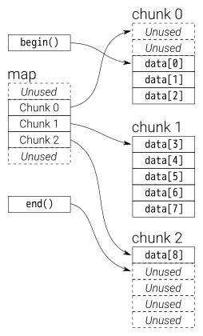

# Deque

`24 March 2023`

----
[`deque`](https://www.geeksforgeeks.org/deque-cpp-stl/)的[发音](https://www.chafayin.com/deque/)比较特殊，读作`deck`，意思是`double end queue`，虽然名字翻译和`list`很像，但是二者底层数据结构差距蛮大。

`deque`对外展现的内存是“连续”的，也就是用户可以随机访问任意元素，看起来和`vector`一样；同时它支持前后端高效插入，像是`vector`和`list`的组合。

实际上，`deque`的内存是分段连续的，并非一致连续，这样连续的“假象”，需要付出的代价是：复杂的迭代器设计，虽然在随机访问方面效率比`vector`略差，但是在插入上，效率会比`vector`高（虽然时间复杂度都是`O(n)`）。
## 概述
这里借用[`stackoverflow`](https://stackoverflow.com/questions/6292332/what-really-is-a-deque-in-stl)上的一章图，这是`deque`底层结构，中心是一个`map`，这是一个控制中心，每一个`chunk`会存储一些元素。

这里每一个`chunk`的内存是连续的，整个`map`的内存也是连续的，但是各个`chunk`之间的内存是没有关联的。因此这是一个分段连续的数据结构，但是对外整体表现出连续性（即，可以使用`operator[]`访问元素）。

<div align=center></div>

## 迭代器
`deque`的`iterator`设计非常复杂，因为对外要模拟一致连续性，一共有`4`条指针。
```c++
	Tp* m_cur;
	Tp* m_first;
	Tp* m_last;
	Tp** m_node;
```
这里`iterator`除了`cur`指针，用于指向当前元素的地址；还需要一对边界指针，即`first`和`last`，这对边界指针标记了当前`chunk`的前后范围；最后，还需要一个指针，记录当前`chunk`在`map`中的位置，由于`map`的元素都是指针（`Tp*`），因此这里需要一个二级指针来表示。
迭代器的运算符重载，这里说明一个，也就是`operator+=`，`operator-=`是基于它实现。
```c++
	Self& operator+=(difference_type n) {
		difference_type offset = n + (m_cur - m_first);
		if (offset >= 0 && offset < difference_type(buffer_size())) {
			m_cur += n;
		}
		else {
			difference_type node_off = offset > 0 ? 
				            offset / difference_type(buffer_size()):
				            -difference_type((-offset - 1) / buffer_size()) - 1;
			set_node(m_node + node_off);
			m_cur = m_first + (offset - node_off * difference_type(buffer_size()));
		}
		return*this;
	}
```
* `fast path`

如果偏移位置在一个`chunk`范围内，并且是正向偏移，那么直接调整`cur`指针即可。

* `slow path`

其余情况，首先需要计算偏移位置会跳过多少个`chunk`，这决定了需要在`map`中移动几格。
之后调用`set_node`，把指针移到对应的`chunk`上；最后在调整`cur`指针，让其指向正确位置。

## deque
有了`iterator`的支持，许多相关的操作实现起来就会容易很多。默认`map`的大小是`8`，也就是一开始有`8`个`chunk`。

但是每个`chunk`能够容纳多少个元素，这个还要取决于`Tp`，也就是容器中每个元素的大小，这里`STL`策略如下：
```c++
inline const size_t buf_size(size_t size) {
	return size < 512 ? (size_t)(512 / size) : 1;
}
```
这里可以看到，如果大小在`512`字节以内，则能够放置`512/sizeof(Tp)`个元素，若对象较大，则每个`chunk`就存放一个元素。
`deque`的基本操作以`insert`为主，在此之前需要了解一些辅助函数（`auxiliary function`），由于前端插入和后端插入代码基本对称，这里以后端插入为例。
* `reverse element at back`

```c++
iterator reserve_ele_at_back(size_type n) {
		size_type vacancy = (m_finish.m_last - m_finish.m_cur) - 1;
		if (n > vacancy) {
			new_ele_at_back(n - vacancy);
		}
		return m_finish + difference_type(n);
	}
```
此函数作用是在尾端预留`n`个元素的位置，首先计算`finish`所在的`chunk`空间是否足够，若足够则直接移动`finish`即可；
若空间不够，则需要调用`new element at back`辅助函数。
```c++
void new_ele_at_back(size_type new_ele) {
		size_type new_nodes = (new_ele + buffer_size() - 1) / buffer_size();
		reserve_map_at_back(new_nodes);
		for (size_type i = 1; i <= new_nodes; ++i) {
			*(m_finish.m_node + i) = allocate_node();
		}
	}
```
同样，首先会判断需要几个`node`（也就是`map`中元素数量），这里会向上取整，保障`map`有足够的空间容纳这些`chunk`；`reserve_map_at_back`的作用和前一个函数类似，预留相应的`map`空间，之后，该函数会初始化每一个`map`的元素。

这里`push_back/front`两个操作便是基于上述辅助函数实现，下面重点分析`insert`。由于最前端插入和最后端插入在插入部分中是开销最低的，因此`insert`函数会考虑优先判断是否属于这两种情形，若不属于，则调用`insert_aux`。
```c++
	iterator insert(iterator pos, const value_type& x) {
		if (pos.m_cur == m_start.m_cur) {
			push_front(x);
			return m_start;
		}
		else if (pos.m_cur == m_finish.m_cur) {
			push_back(x);
			iterator tmp = m_finish;
			--tmp;
			return tmp;
		}
		else {
			return insert_aux(pos, x);
		}
	}
```
这里前两种情况相当于`fast path`，最后一种情况是`slow path`。`insert_aux`函数有很多重载，其中一个如下：
```c++
void insert_aux(iterator pos, size_type n, const value_type& x) {
		const difference_type ele_before = pos - m_start;
		size_type length = size();
		if (ele_before < difference_type(length / 2)) {
			iterator new_start = reserve_ele_at_front(n);
			iterator old_start = m_start;
			// [WARNING] `m_start` may reset after calling `reserve_ele_at_front`
			pos = m_start + ele_before;
			if (ele_before >= difference_type(n)) {
				iterator start_n = m_start + difference_type(n);
				uninitialized_copy(m_start, start_n, new_start);
				m_start = new_start;
				copy(start_n, pos, old_start);
				fill(pos - difference_type(n), pos, x);
			}
			else {
				iterator it = uninitialized_copy(m_start, pos, new_start);
				uninitialized_fill(it, m_start, x);
				m_start = new_start;
				fill(old_start, pos, x);
			}
		}
		else {
			// ...
		}
	}
```
代码总体很长，但是分为两个部分，并且两者代码对称，因此只需要分析其中一个。

最大的`is-else`，其实在判断插入位置靠近前端还是后端，因此和`length / 2`比较，若靠近前端，则考虑移动前端的元素（`if`）；若靠近后端（`else`），则移动后端的元素。通过这种策略，能够尽可能减少元素的移动，这也是`deque`的`insert`比`vector`高效一些的原因（相对）。

> 为什么要移动元素？
> 这里在连续空间的中间插入元素，由于不能直接增加位置，因此只能像`vector`一样，移动元素，腾出位置。

> 但是，`deque`的部分连续，一个`chunk`只需要移动其地址（相当于把这个“篮子”重新挂在`map`的某个位置），移动的代价会小一些。

* 预留空间

首先会在前面预留好`n`个位置的空间，这里有一个“小坑”，也就是`WARNING`这一行注释的下面这一行：

为什么还需要对`pos`重新赋值，这看起来有些多次一举，其实是因为函数`reserve_ele_at_front`。

这个函数看似是在前端预留`n`个位置，但很有可能前端没有足够数量的空间，此时需要重新分配内存！因此整个`map`可能会被重新拷贝到一个新的位置，因此原有的`pos`会**失效**，这与`vector`迭代器失效的原理是一样的！

第一个`if`（也就是插入位置靠近前端），又分为两种情况：

* 移动的元素数量比插入数量`n`大

`ele_before`是`pos`前面需要移动的元素，插入的元素数量为`n`，这里`ele_before`比`n`大，则：

（1）优先把`[m_start, m_start + n)`，也就是当前`deque`的前`n`个元素向前拷贝到`new_start`的位置；

（2）接下来，把剩下的从`[m_start+n,pos)`的元素拷贝到`（1）`的后面；

（3）最后，将`[pos -n , pos]`填充为插入元素的（默认）值。

或许会有疑问，为什么（1）和（2）要分开做，合在一起不是更加省力？这是因为新分配的`n`个位置的是没有被初始化的（只是原始内存，没有调用构造函数），因此需要单独考虑。

* 移动的元素数量比插入数量`n`小

这种情况类似，只需要将`[m_start, pos)`的元素拷一并贝至`new_start`处；然后将剩下的部分都进行填充即可（注意这里同样会调用两种不同的`API`，因为有些内存是没有被初始化的）。

对称的部分代码是类似的。

这里其余的操作基本围绕`insert`展开，其他的接口也相对简单，不逐一赘述，可以参考源代码。

## 总结
`deque`这样一个数据结构，是`vector`和`list`的一种平衡，既希望能够随机访问元素，又希望能够在首末两端插入元素的时候有较好的性能。当然这是有代价的：

（1）`deque`的`iterator`设计相对复杂，为了对外界模拟出这样的连续性，一个`iterator`需要存储`4`个指针。

（2）`deque`的连续性始终是模拟的结果，若`object`大小较大，基本会退化为`vector`（甚至不如`vector`）。

（3）对`cache locality`的友好性比起`vector`会有一些欠缺。 

当然，`deque`也有优点：

（1）`deque`兼顾了`insert`的性能，若希望能随机访问元素，又对容器有中间插入的需求，`deque`是一个不错的选择。

（2）承接`（1）`，`deque`可以被进一步封装为**队列**这种数据结构。事实上，`STL`的队列默认容器确实是`deque`。
因为队列有两个开口，**后进前出**。这一点，显然`vector`难以做到（通过`erase`效率非常低）。
